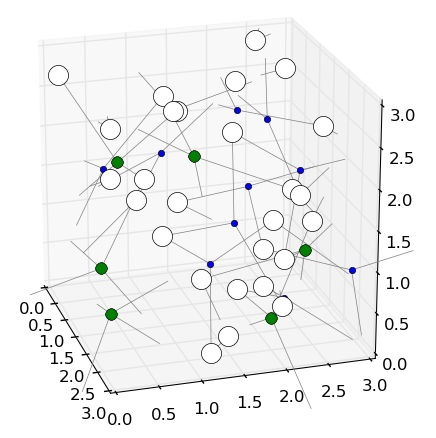

#graph-drawing-glass

Unfinished, unpolished code playing around with the idea of using force-directed graph drawing algorithms as a means of generating glass network structure based on local coordination rules. 

The force-directed positioning was successful, but I didn't get to the point of introducing bond-breaking to improve on the initial random topology, so the structures produced aren't physically plausible.

